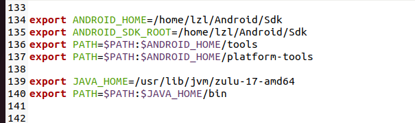
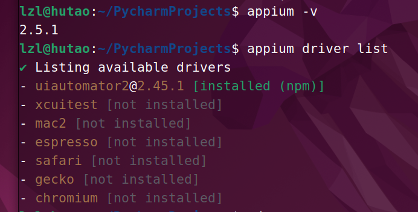
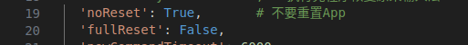
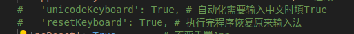
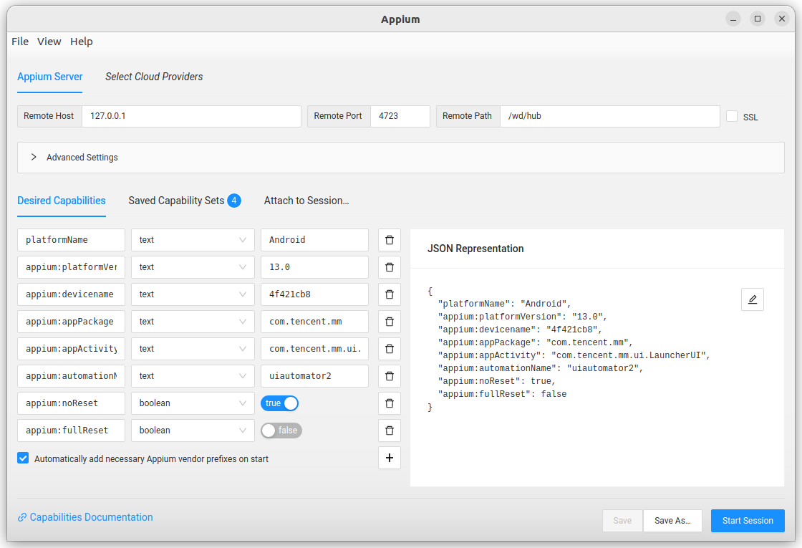

# Android-Automation
利用appium和adb自动化操作安卓应用程序

# 关于appium
## 安装与配置依赖
```
Node >=18.00
NPM > 8.0
```
针对Android设备，需要配置ANDROID_HOME、ANDROID_SDK_ROOT和JAVA_HOME
其中ANDROID_HOME、ANDROID_SDK_ROOT均为你的Android SDK目录
```
gedit ~/.bashrc
source ~/.bashrc
```



```
sudo npm i --location=global appium
appium driver install uiautomator2
pip install Appium-Python-Client
```
```
appium -v
appium driver list
```

最后还要去appium官网下appium inspector；用来定位元素，虽然这玩意是真难用

## 代码

只有wx.py有用，main.py和bookingtest.py是简单的测试；整体框架是官网给的，具体实现参考：https://www.byhy.net/auto/appium/01/

## 功能
打开微信，跳转小程序页面，利用adb输入文字搜索并逐个点击，目的是缓存微信小程序的.wxapkg包，用来后续检测
（为什么不用appium搜索？因为遇到了解决不了的bug，后面会说）
## Q&A

Q：用appium打开微信每次都要重新登录？

A：困扰了我好久，我都想把自动化登录写好了，结果每次都要验证消息，后来发现在配置里增加：

即可，这也很坑，我刚开始找的代码只有noReset配置，还是要重新登录，加了后一条才好！
参考：https://www.cnblogs.com/alantammm/p/10601180.html

***
Q：用appium inspector进行点击跳转不到对应的页面怎么办？刷新也不行

A：把页面叉掉，在appium inspector的启动配置那里把包名和activity删掉，只留android启动，进去就是刷新后的页面；但如果是里面的元素定位不到，那就没办法了
https://blog.csdn.net/qq_33282850/article/details/130616564

***

Q：用完appium输入法没了

A：按理来说需要输入中文才会打开这两条配置：

但我实测用完还是恢复不了原来的输入法，不知道为啥，只能手动在手机设置输入法里切换

***
Q：如何启动appium与appium inspector？

A：appium --base-path /wd/hub

***
Q：遇到报错：Caused by: io.appium.uiautomator2.common.exceptions.UiAutomator2Exception: Timed out after 15557ms waiting for the root AccessibilityNodeInfo in the active window. Make sure the active window is not constantly hogging the main UI thread (e.g. the application is being idle long enough), so the accessibility manager could do its work

A：https://github.com/appium/appium/issues/19911
***
Q：除了appium还能怎么自动点击

A：adb shell input xxx（点击，输入，滑动）基本操作都能实现，wx.py里也有写
对于坐标获取，小米手机：设置中搜索指针位置，打开即可显示坐标

***
Q：adb的输入不能输入中文？

A：https://github.com/senzhk/ADBKeyBoard

***

Q：微信小程序.wxapkg的存储位置?

A:
```
adb pull /data/data/com.tencent.mm/MicroMsg/{User}/appbrand/pkg ./

```
反转了，在这个目录下找到了：/data/data/com.tencent.mm/MicroMsg/appbrand/pkg

***
Q:如何获取activity和包名

A：包名直接百度搜

activity的话：
```
adb shell dumpsys window | grep mCurrentFocus
```

## Finally
自动化真折磨人啊，实际测试效果一般我觉得
